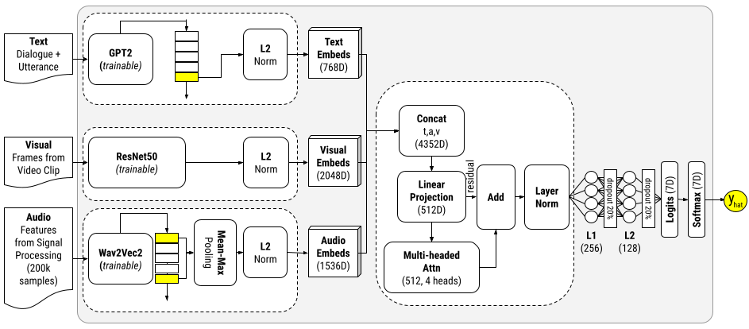
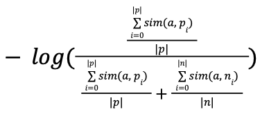
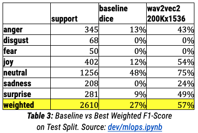
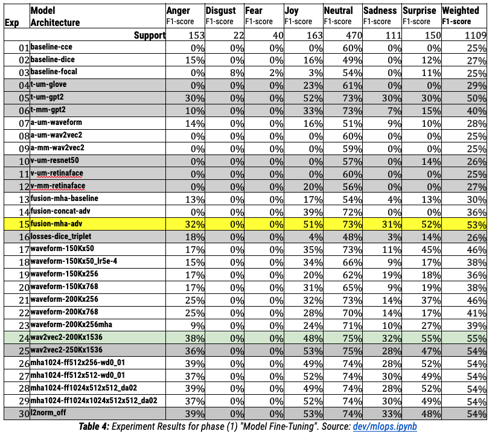
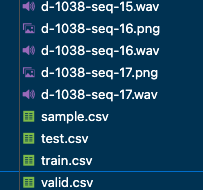

# Package `hlm12erc`

# HLM12ERC, A High-Quality Open Source PyTorch-based Multimodal Emotion Classifier

HLM12ERC model, a multimodal emotion classifier capable of processing
text, audio and video, based on a model ensemble architecture that
combines powerful backbone embedding models and advanced feature
fusion techniques to create rich representations used for emotion
inference.

The present model is the output of the project [HLM12ERC, a Multimodal Model for Emotion Recognition in Conversations: Final Report](dev/project.pdf) by Hudson Mendes (myself), a student of the University of London, United Kingdom, as part of the CM3070 Final Project module.

## Model Architecture



### Components

The final model was implemented using the following components

* **Text Encoder**: `ERCGpt2TextEmbeddings`
* **Audio Encoder**: `ERCWave2Vec2Embeddings`
* **Visual Encoder**: `ERCResNet50Embeddings`
* **Fusion**: `ERCMultiHeadedAttention`
* **Loss**: `DiceCoefficientLoss`

### Interesting Bits

* The `ERCGpt2TextEmbeddings` encodes the entire dialogue using the GPT2 and a prompt engineered to include information about the Speaker's state, following findings resulting from the DialogRNN researchDialogRNN[Majumder et al, 2019]

* Further research is required to make **Triplet Loss* work for the HLM12ERC model, but the `ERCDataSampler`, `ERCTripletLoss` and the `ERCTrainerTripletJob` classes are a good starting point if you want to explore the possibility, and they utilise the following loss equation:<br />


## Final Evaluation

### MELD Benchmark



## Experimentation Detailed Results

### MELD Dataset




## Installation

### Running on Colab

You need to massage stuff a bit in your google drive, unfortunately, but here is a Jupyter Notebook to help.

> `CM3070 FP, MLOps [R1].ipynb`<br />
> Open [Google Colab Notebook](https://colab.research.google.com/drive/1UMP0B3Wj9HXWn4zTduMWZdyrRUxikUtx?usp=sharing)<br />

### Running Locally

If your objective is training, using or extending the model, you should install using the following commands.

1. Clone the repository

```
source=git@github.com:hudsonmendes/uolondon-cm3070-fp.git
git clone $source hlm12erc
cd hlm12erc
```

2. Create & Activate the Virtual Environment

```bash
virtualenv venv
source venv/bin/activate
```

3. Install the dependencies

```bash
pip install -e '.[dev,test,etl,modelling,training,serving]'
```

### EDA

The dependencies used by the EDA are not compatible to the ones
used during the model development. Therefore, you should install
the dependencies for the EDA in a separated vitualenv.

```bash
virtualenv venv_eda
source venv_eda/bin/activate
pip install -e '.[eda]'
```

## ETL

To save time consuming data from the MELD Dataset[1], you must run the ETL process to produce simplified and compatible data assets. You can do so by running the following command.

```bash
python -m hlm12erc etl kaggle \
    --owner "zaber666" \
    --dataset "meld-dataset" \
    --subdir "MELD-RAW/MELD.Raw" \
    --dest "./data" \
    --force "False"
```

Your data folder should look something like the following:



## Architecture Components

The current version of the model utilises the following configuration:
```yml
classifier_name: final
classifier_loss_fn: dice
classifier_learning_rate: 0.00005
classifier_weight_decay: 0.1
classifier_warmup_steps: 2000 # @ ~15% => 9989 (examples) / 8 (batch) = 1,249 (step) x 10 (epochs) = 12,490 steps
classifier_metric_for_best_model: f1_weighted
classifier_early_stopping_patience: 5
classifier_classes:
  - anger
  - disgust
  - fear
  - joy
  - neutral
  - sadness
  - surprise

modules_text_encoder: gpt2
modules_visual_encoder: resnet50
modules_audio_encoder: wav2vec2
modules_fusion: multi_headed_attn

text_in_features: -1 # defined by tokenizer & padding
text_out_features: -1 # defined by the encoder output hidden state

audio_in_features: 250000 # truncates the waveform after 250K samples
audio_out_features: -1 # defined by wav2vec2

visual_in_features: [3, 256, 721] # input required for resnet50
visual_out_features: -1 # defined automatically by resnet50

fusion_out_features: 512
fusion_attention_heads_degree: 3 # for 512, degree 3 = 4 heads

feedforward_layers:
  - out_features: 256
    dropout: 0.2
  - out_features: 128
    dropout: 0.2
```

## Further Work

There are known areas of improvements for this model. If you're
interested in developping it further, please reffer to the items
below for inspiration.

> (1) The present project used the ResNet50 as its most basic Visual Feature Extraction mechanism, and it has done so to facilitate the interpretation of the results comparing using the entire scene to using only the faces detected by the ReTinaFace/ResNet-50[Yanjia et al, 2021]. However, in doing so, it did not explore the possibility of using smaller models that could potentially learn representations just as effectively, as well as learn to focus on particular areas of the image using mechanisms such as Attention[Vaswani et al, 2017] which is known to have a weighting effect on features, similar to what has been recently been popularised by Visual Transformers. Further work could explore this solution space further to possibly create a more efficient model.
>
> (2) Given the exceptional results achieved by M2FNet[Chudasama et al, 2022], SPCL-CL-ERC[Song et al, 2022] and the learnings delivered by the current project on the topic, the potential of Contrastive Learning still offers a great opportunity for further exploration. Different sampling strategies such as the one proposed by ERCDataSampler combined with adaptations of the Triplet Loss function devised by the ERCTripletLoss can be studied in more depth and potentially render significant results. However, sampling strategies that result in oversampling as well as the sheer computation costs of training multimodal models must be taken in consideration. Combined with the computational cost and complexity of the topic to be explored, research working on improving classification using Triplet Loss is advised to focus on this specific topic in isolation and go deeper rather than wider.
>
> (3) Finally, given that the HLM12ERC is a native PyTorch model, it could be engineered to be exported as a PreTrainedModel into the Huggingface repository, facilitating for users to download and embed the model to their systems through the transformers API.

## References

[1]MENDES, H. L., 2023. "HLM12ERC, a Multimodal Model for Emotion Recognition in Conversations: Final Report", University of London, United Kingdom.

[2] S. Zahiri and J. D. Choi. Emotion Detection on TV Show Transcripts with Sequence-based Convolutional Neural Networks. In The AAAI Workshop on Affective Content Analysis, AFFCON'18, 2018.

[3] S. Poria, D. Hazarika, N. Majumder, G. Naik, E. Cambria, R. Mihalcea. MELD: A Multimodal Multi-Party Dataset for Emotion Recognition in Conversation. ACL 2019.
